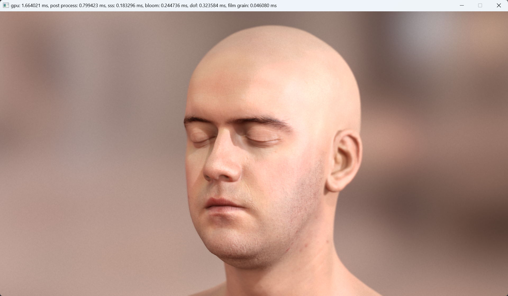

# RayderX

Vulkan reimplementation of [Separable Subsurface Scattering by Jorge Jimenez and Diego Gutierrez](https://github.com/iryoku/separable-sss), for the purposes of learning about character rendering techniques.

The plan is to use this as a base for experimenting with newer character rendering techniques and ray tracing.

